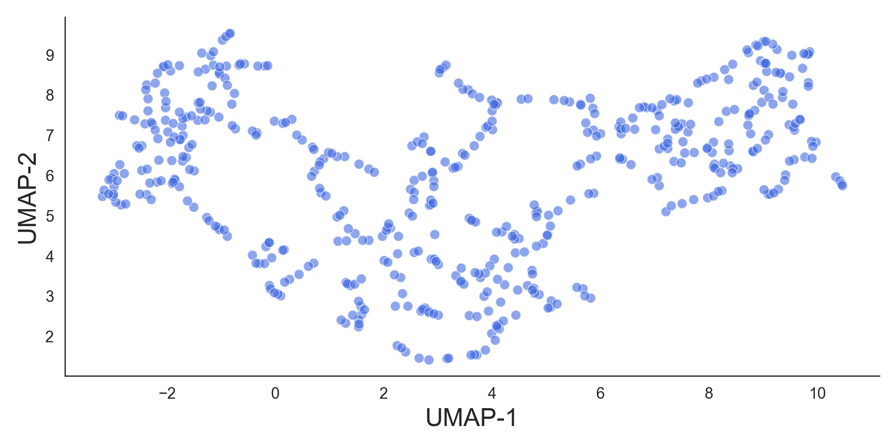

# Vector Quantized-Variational AutoEncoder (VQ-VAE)

## A discretized version of the traditional Variational AutoEncoder (VAE)

This repository contains an implementation of the Vector Quantized-Variational AutoEncoder (VQ-VAE) [1] in order to learn features from phase-contrast images of T cell interaction with adhesion molecules.

Input images / Reconstructed images: \

2D UMAP embedding of the discrete latent space: \

1. Oord, A.V., Vinyals, O., & Kavukcuoglu, K. (2017). Neural Discrete Representation Learning. ArXiv, abs/1711.00937.
